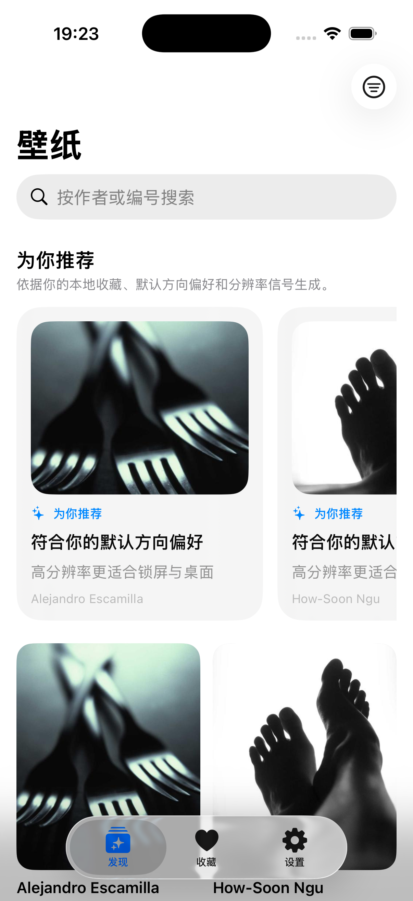
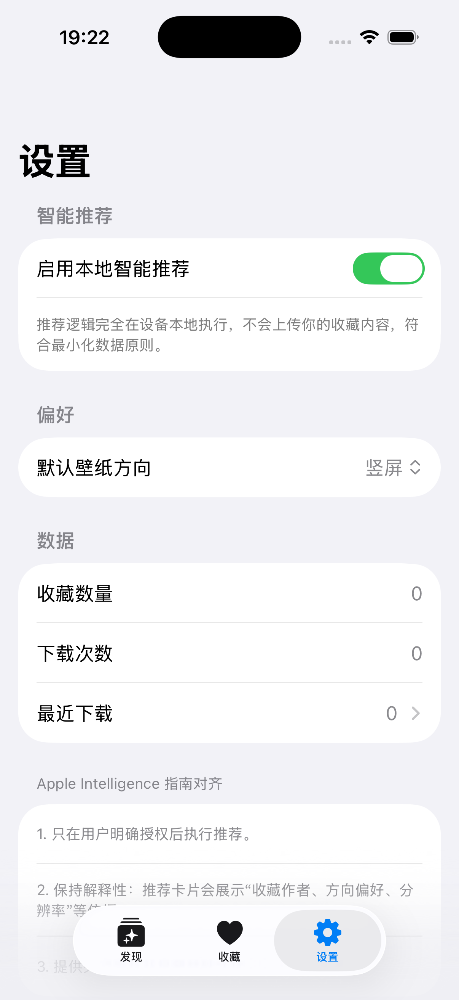
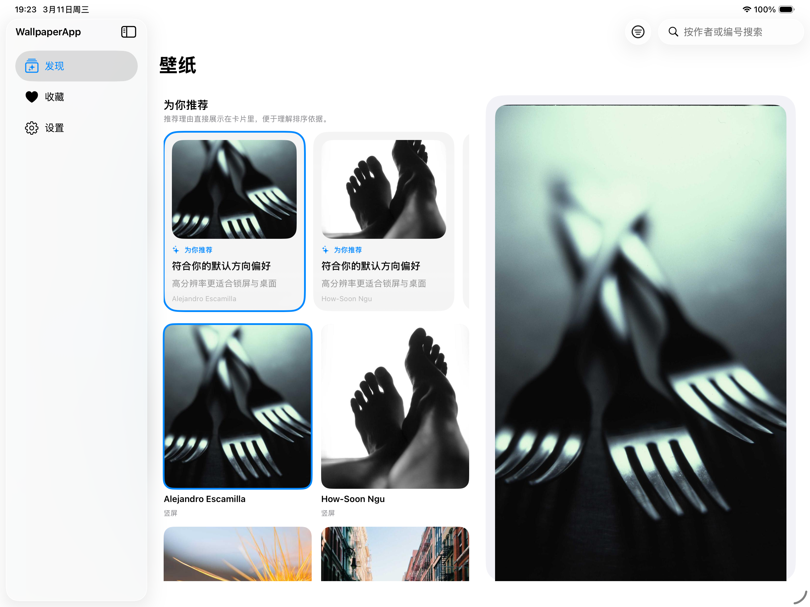

# WallpaperApp

WallpaperApp is a SwiftUI iOS wallpaper browser for iPhone and iPad. You can
browse remote wallpapers, save favorites, write images to Photos, review recent
downloads, and see recommendation cards that explain why a wallpaper was ranked
higher.

[](https://github.com/JasirVoriya/ios-wallpaper/actions/workflows/ios-ci.yml)
[](./LICENSE)


## Screenshots

This section shows the current product surface. Because no physical iPhone or
iPad was connected on March 11, 2026, the gallery currently uses screenshots
from the running simulator build.

**iPhone discovery**



**iPhone settings**



**iPad split view**



## What it includes

This section summarizes the current product surface so you can understand what
already exists before you add new features.

- Adaptive navigation for iPhone and iPad. Phones use a tab bar, and iPads use
  a split view sidebar.
- A discovery experience with search, orientation filtering, infinite scroll,
  explainable recommendations, and large previews.
- A favorites screen backed by SwiftData.
- A recent downloads screen that lets you reopen and clear local download
  history.
- A wallpaper detail screen with save, favorite, share, and source actions.
- An App Shortcuts entry that opens the app from the Shortcuts app or Siri.

## Tech stack

This section describes the implementation choices that shape the codebase.

- `SwiftUI` for the full UI layer
- `SwiftData` for local persistence
- Swift 6.2 with `SWIFT_STRICT_CONCURRENCY = complete`
- `Photos` for write-only image saving
- `AppIntents` for app shortcuts support
- `XcodeGen` as the project source of truth through `project.yml`
- The Picsum API as the remote wallpaper source

The project does not use third-party runtime dependencies.

## Requirements

You must use a recent Apple toolchain because the project currently targets
iOS 26.0 and Swift 6.2.

- macOS with Xcode 26.3 or later
- `xcodegen` 2.44.1 or later
- An available iOS 26 simulator or a compatible device
- Network access for wallpaper browsing and image downloads

## Run locally

You can build the app from Xcode or from the command line. If you change the
project structure, regenerate the Xcode project before building.

1. Install `xcodegen` if it is not already available.

   ```bash
   brew install xcodegen
   ```

2. Generate the Xcode project from `project.yml`.

   ```bash
   xcodegen generate
   ```

3. Open the project in Xcode.

   ```bash
   open WallpaperApp.xcodeproj
   ```

4. Select an iPhone or iPad simulator, then run the `WallpaperApp` scheme.

If you prefer the command line, use the following build command.

```bash
xcodebuild -project WallpaperApp.xcodeproj \
  -scheme WallpaperApp \
  -destination 'generic/platform=iOS Simulator' \
  build
```

## Test the project

The repository includes a unit test target for the recommendation engine. Run
tests on any available simulator.

```bash
xcodebuild -project WallpaperApp.xcodeproj \
  -scheme WallpaperApp \
  -destination 'platform=iOS Simulator,name=iPhone 17 Pro' \
  test
```

If `iPhone 17 Pro` is not installed on your machine, replace it with any
available simulator name from `xcrun simctl list devices`.

## Project structure

This section gives you a quick map of the repository so you can place new code
without fighting the existing layout.

- `.specify/`: Spec-Kit constitution, templates, and helper scripts
- `.codex/prompts/`: generated `/speckit.*` prompts for Codex
- `specs/`: product baseline documents, roadmap, and numbered feature specs
- `WallpaperApp/App`: app entry point and shared service container
- `WallpaperApp/AppIntents`: Shortcuts and Siri entry points
- `WallpaperApp/Models`: SwiftData models and shared value types
- `WallpaperApp/Services`: API access, recommendations, preferences, favorites,
  download history, and Photos integration
- `WallpaperApp/ViewModels`: screen-level state orchestration
- `WallpaperApp/Views`: feature UIs for discovery, favorites, settings, and
  adaptive root navigation
- `WallpaperAppTests`: unit tests
- `project.yml`: XcodeGen configuration

## Development workflow

This repository now uses GitHub Spec-Kit for non-trivial product and engineering
work. Feature work starts with a numbered spec under `specs/`, guided by the
constitution in `.specify/memory/constitution.md`.

- Use [CONTRIBUTING.md](./CONTRIBUTING.md) for the required repository workflow
- Use [specs/README.md](./specs/README.md) for the spec directory structure
- Use [specs/foundation/product-spec.md](./specs/foundation/product-spec.md)
  for the current product baseline
- Use [specs/roadmap.md](./specs/roadmap.md) for priorities
- Use [specs/002-multiplatform-architecture/spec.md](./specs/002-multiplatform-architecture/spec.md)
  as the current active Spec-Kit feature
- Use [specs/001-offline-wallpaper-caching/spec.md](./specs/001-offline-wallpaper-caching/spec.md)
  as the next follow-up feature

## Product notes

This section calls out the platform constraints and privacy behavior that matter
when you evolve the app.

- The app saves images to Photos, but iOS does not let third-party apps set the
  system wallpaper automatically.
- Recommendation logic runs on device. The app does not upload favorites to a
  recommendation service.
- Download history and user preferences are stored locally with SwiftData.
- Wallpaper browsing depends on the external Picsum service, so the app does
  not currently support offline browsing.

## Changelog

Use the changelog to separate released work from in-progress updates.

- See [CHANGELOG.md](./CHANGELOG.md) for committed and unreleased changes.

## License

WallpaperApp is available under the [MIT License](./LICENSE). The current
license keeps the public repository easy to reuse while you continue shipping
product features.

## Next steps

You can use the current foundation to keep product work moving without a large
restructure.

1. Implement the shared-core and native-shell plan in
   [multiplatform architecture](./specs/002-multiplatform-architecture/spec.md).
2. Continue with [offline wallpaper caching](./specs/001-offline-wallpaper-caching/spec.md)
   on top of the new architecture boundaries.
3. Add snapshot or UI tests for the adaptive iPhone and iPad layouts.
4. Expand the recommendation engine with more explicit user controls and
   feedback signals.
